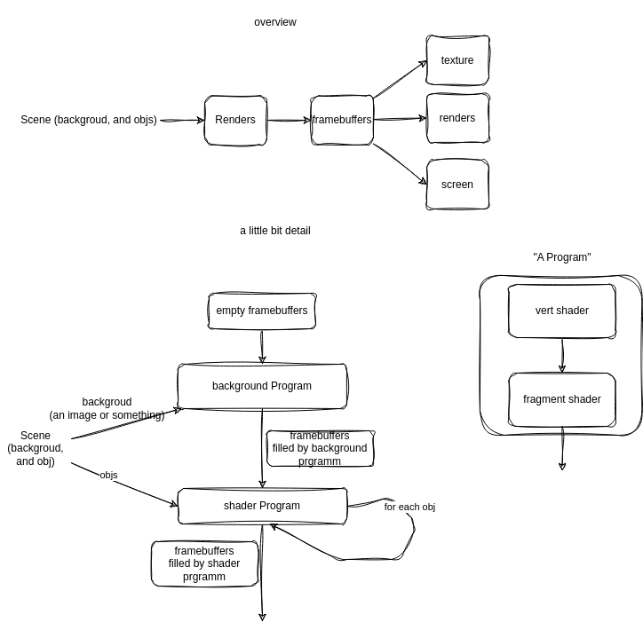

# how does OpenGL pipeline work?

+ A scene include backgroud and many objs. (backgroud can be regared as a special obj)
+ how to render a image?
  + apply renders to each obj! (one obj after another)
  + for different obj can be applied to different render (the result is saved into frame buffers (color and depth))
  
+ for "Program", it can be seen as a pipeline, generally, it consists a vert shader and a fragment shader.

