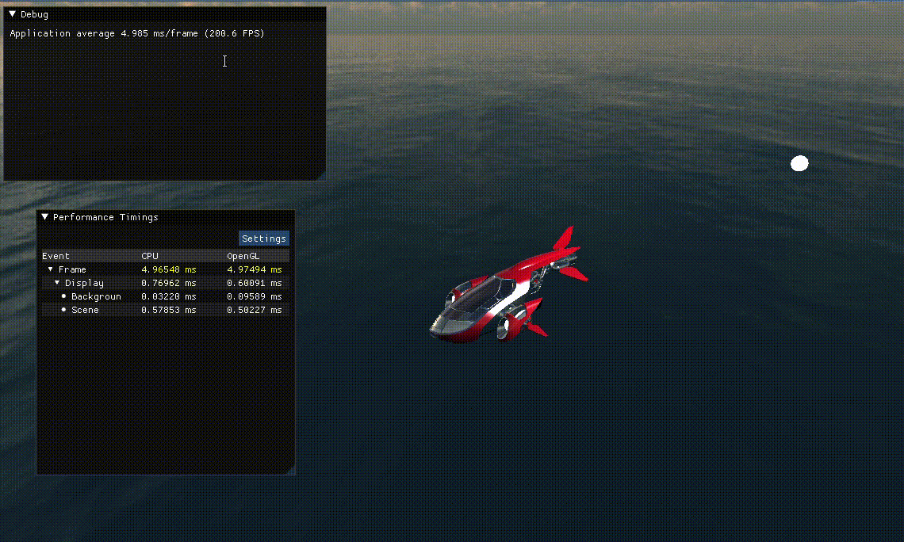

# Description
This is the repository for the basic project template for the Advanced Computer Graphics course given at Chalmers University of
Technology.

You can find instructions on how to build at http://www.cse.chalmers.se/edu/course/TDA362/tutorials/start.html

README_LINUX.md has some specific instructions for linux users.

# For environment 
It can run in chalmers remote machine now, we fixed the depended libs. 
But still, due to opengl setting of remote machine, which uses llvm render, it cannot use 
the gpu directly.

+ if there are any environment problems, you can try to install these dependency yourself.

+ install sdl2
https://github.com/libsdl-org/SDL/releases/tag/release-2.30.1

```
./configure --prefix=YOUR_INSTALLING_PATH

make install -j12
```

+ install glew (OpenGL extension Wrangler)
download from:
https://sourceforge.net/projects/glew/files/glew/2.1.0/glew-2.1.0.tgz/download

```
make GLEW_DEST=YOUR_INSTALLING_PATH install
```

# how to build
1. mkdir build 
2. cd build 
3. cmake ..
4. make -j12

# how to run
1. bash run.sh


# Demo
+ you should see something like this:
