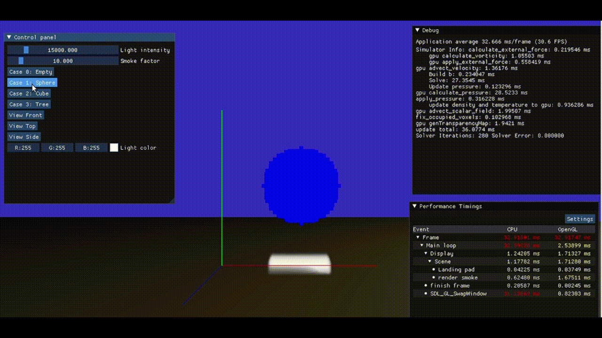
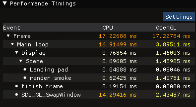
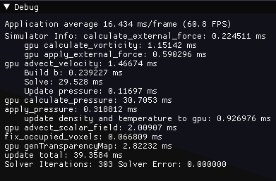
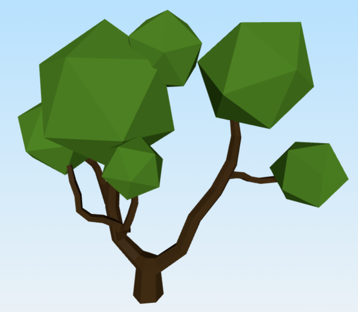
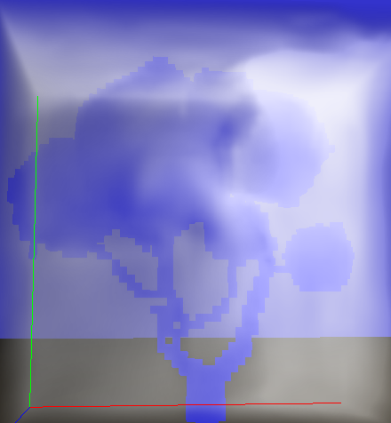

# Description
This repository is for the Advanced Computer Graphics course given at Chalmers University of Technology. 

A real time GPU(cuda) smoke simulator was implemented, based on gird method, using semi-lagrance method and linear interpolation.
A render using ray marching to perform self-shadowing is provide. And in order to speed up rendering in our lab machine which uses llvm opengl (cpu), the light intensive of each voxel is computed by a cuda kernel too. 

Some results are showed below:

|empty|sphere|cube|
|-|-|-|
| |||


## Performance
Now, this simulator can run at 30fps for gird size: 50 * 50 * 50 (real time!). 

|render pipeline|gpu|
|-|-|
|||

## Voxelizer 
A simple voxelizer, scans each layer of the object.

|mesh|voxelized|
|-|-|
|||


# For environment 
It can run in chalmers remote machine now, we fixed the depended libs. 
But still, due to opengl setting of remote machine, which uses llvm render, it cannot use the gpu directly.

+ if there are any environment problems, you can try to install these dependency yourself.

+ install sdl2
https://github.com/libsdl-org/SDL/releases/tag/release-2.30.1

```
./configure --prefix=YOUR_INSTALLING_PATH

make install -j12
```

+ install glew (OpenGL extension Wrangler)
download from:
https://sourceforge.net/projects/glew/files/glew/2.1.0/glew-2.1.0.tgz/download

```
make GLEW_DEST=YOUR_INSTALLING_PATH install
```

# How to build
1. mkdir build 
2. cd build 
3. cmake ..
4. make -j12

# How to run
1. bash scripts/run.sh
